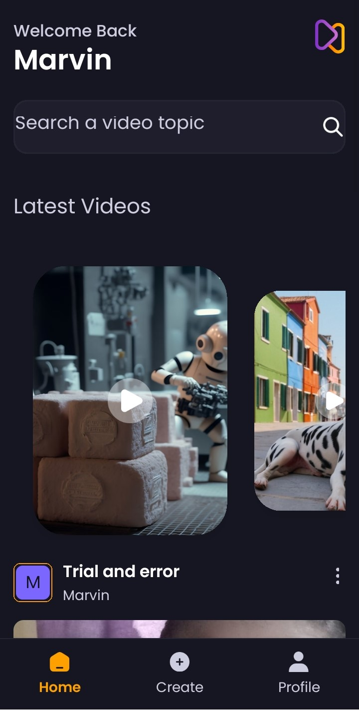

# Aora

Aora is a video-sharing app built with React Native and Appwrite, allowing users to create, bookmark, and view videos, including the latest videos. The app is developed using Expo and can be run in development mode with the Expo client app.


## Table of Contents

- [Features](#features)
- [Installation](#installation)
- [Running the App](#running-the-app)
- [Screenshots](#screenshots)
- [Technologies Used](#technologies-used)
- [Contributing](#contributing)
- [License](#license)

## Features

- Create and upload videos
- Bookmark favorite videos
- View all videos and latest videos
- User authentication and profile management

## Installation

1. Clone the repository:

   ```bash
   git clone https://github.com/marvin-nyalik/AoraE.git
   cd aora
   ```

2. Install dependencies:

   ```bash
   npm install
   ```

3. Set up the Appwrite backend:
   - Follow the [Appwrite installation guide](https://appwrite.io/docs/installation) to set up your Appwrite server.
   - Configure your Appwrite project and obtain the necessary API keys and endpoint.


## Running the App

1. Start the Expo development server:

   ```bash
   npx expo start
   ```

2. Open the Expo client app on your mobile device or emulator and scan the QR code to run the app.

## Screenshots





## Technologies Used

- **React Native**: For building the mobile app.
- **Expo**: For running the app in development mode.
- **Appwrite**: For managing the backend and database.
- **JavaScript**: Programming language used for development.

## Contributing

Contributions are welcome! Please follow these steps to contribute:

1. Fork the repository.
2. Create a new branch:

   ```bash
   git checkout -b feature/your-feature-name
   ```

3. Make your changes and commit them:

   ```bash
   git commit -m 'Add some feature'
   ```

4. Push to the branch:

   ```bash
   git push origin feature/your-feature-name
   ```

5. Open a pull request.

## License

This project is licensed under the MIT License. See the [LICENSE](LICENSE) file for details.
